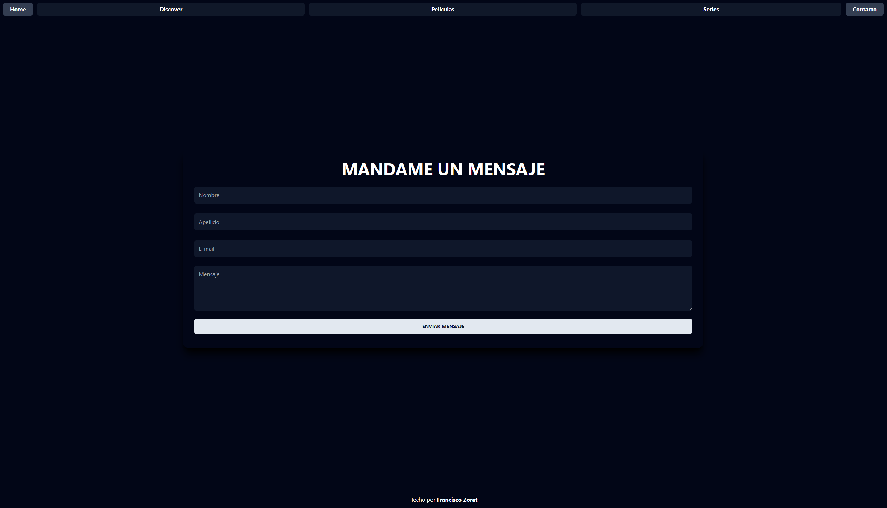

# VanillaJS y TailwindCSS

Mirá la demo en vivo [acá](https://ifraan.github.io/tp4_vanillajspage/) (gracias github-pages)

-   Pagina hecha en VanillaJS con Tailwind como libreria CSS.
-   Usa bootstrap solo para el carrousel.

## Caracteristicas

-   [x] Wrapper API "inteligente" desde una unica fuente mock
    -   [x] fetchMovies
    -   [x] fetchTv
    -   [x] fetchAll -> parametrizado
        -   [x] random -> mezcla los resultados
        -   [x] limit -> devuelve los x primeros items
-   [x] Intenta imitar un sistema de componentes
    -   [x] Navbar consistente y animada onHover
    -   [x] Footer consistente
    -   [x] Cards del Home animadas onHover
        -   [x] OnClick trigerean la busqueda de ese item **en el carrousel**
-   [x] Algoritmo de filtros acumulativos de distintas propiedades.
    -   [x] En lugar de hardcodear condiciones, se pueden agregar attributos al objeto de busqueda.
    -   [x] Está en las paginas de Discover/Movies/TV
-   [x] Se 're-usa' el controller de discover/movies/tv como si fuera una unica template.
    -   [x] Decide que items pedir a la API segun la pagina en la que está parado.

## Screenshots

